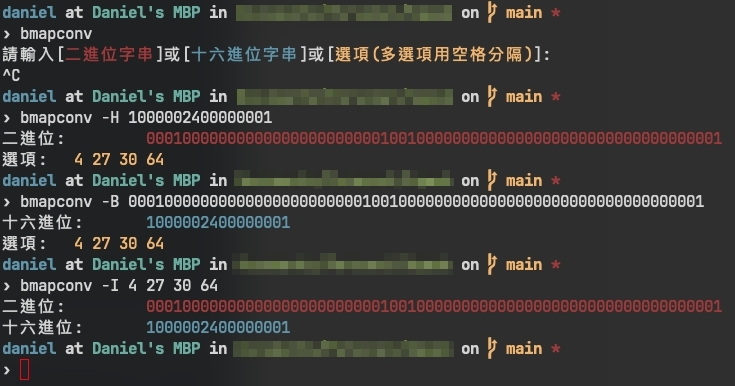

# bmapconv
 BitMap(64位)轉換工具


# 使用
- -h 顯示說明
- -v 顯示版本
- -B <BinaryString> 輸入`2進位字串`，回饋`16進位字串`及`所有索引`
- -H <HexString> 輸入`16進位字串`，回饋`2進位字串`及`所有索引`
- -I <IndexesString> 輸入`索引`(多索引用空格分割)，回饋`2進位字串`及`16進位字串`

無輸入參數時，則使用循環模式。

# 編譯
- 只編譯本地環境
```bash
make all
```

- 跨平台編譯
```bash
cargo make all
```
